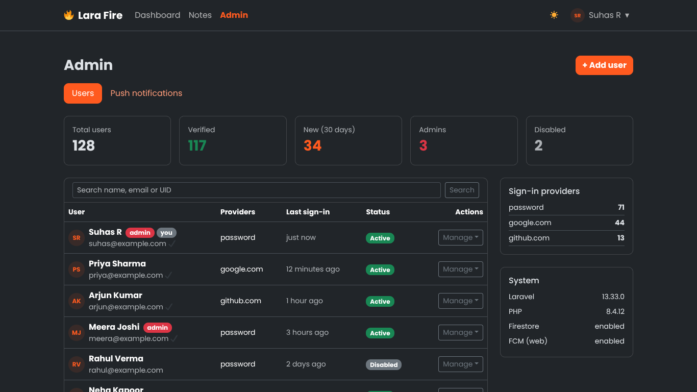
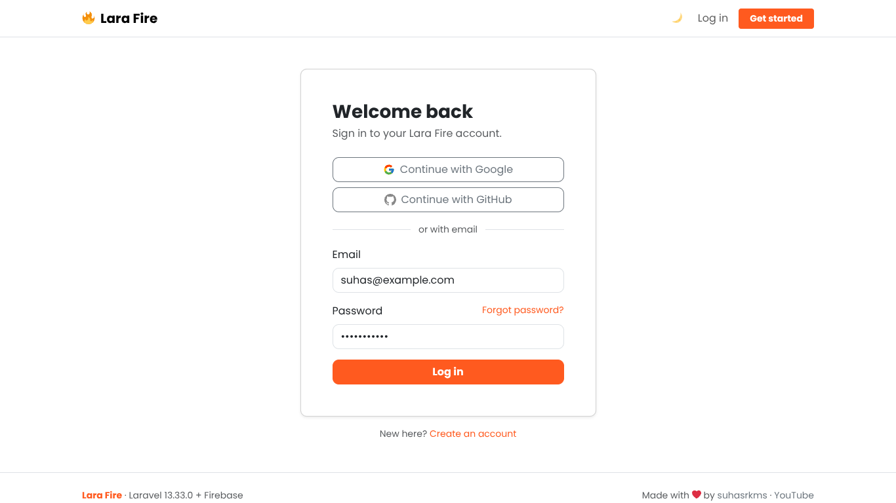
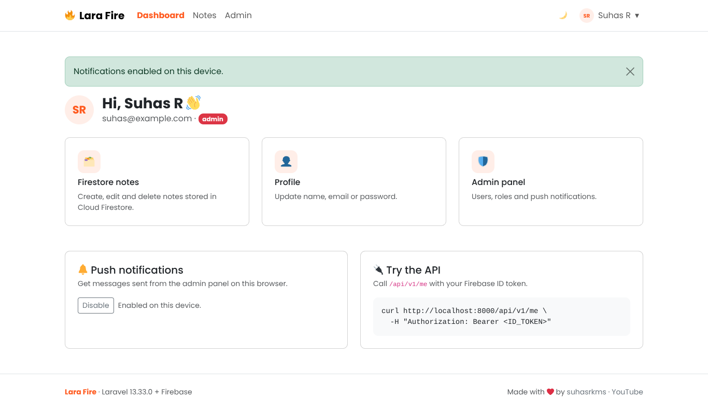
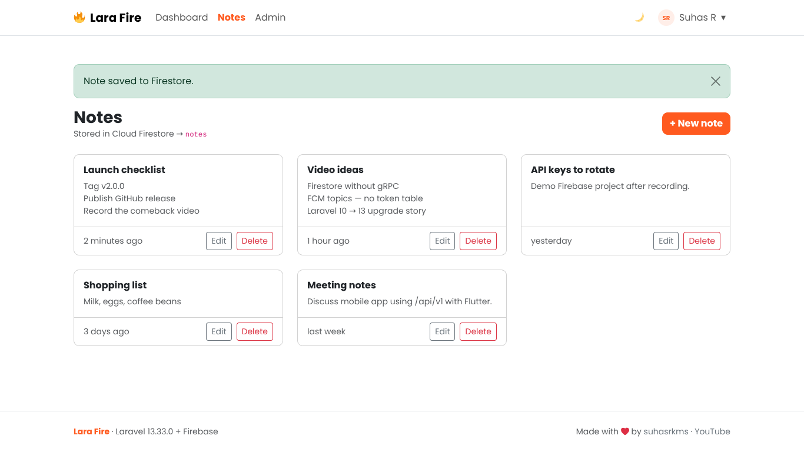

<p align="center">  </p>

# 🔥 Lara Fire

[](https://packagist.org/packages/suhasrkms/lara-fire)
[](https://packagist.org/packages/suhasrkms/lara-fire)
[](https://github.com/suhasrkms/Lara-Fire/actions/workflows/tests.yml)
[](LICENSE.md)

**A Laravel 13 + Firebase starter kit.** Firebase Authentication, an admin panel driven by custom claims, Cloud Firestore CRUD, push notifications and a REST API that accepts Firebase ID tokens. No SQL database is needed.

| | Feature |
|---|---|
| 🔐 | Email/password, **Google** and **GitHub** sign-in, email verification, password reset |
| 🛡️ | **Admin panel**: search, stats, grant/revoke admin, enable/disable users, send reset links |
| 🗂️ | **Cloud Firestore** Notes module: per-user CRUD over REST, with no gRPC needed |
| 🔔 | **FCM push**: users opt in per browser, and admins broadcast or target one user |
| 🔌 | **REST API** `/api/v1` authenticated with `Authorization: Bearer <Firebase ID token>` |
| 🌙 | Bootstrap 5.3 UI with dark mode, built with Vite 8 |



<p align="center">  </p>

📖 **Full documentation: [suhasrkms.github.io/lara-fire-docs.html](https://suhasrkms.github.io/lara-fire-docs.html)**

## Quick start

```bash
composer create-project suhasrkms/lara-fire my-app
cd my-app
npm install && npm run build
```

1. **Service account:** open Firebase console → Project settings → Service accounts → *Generate new private key*. Save the file as `storage/app/firebase/service-account.json`. It is git-ignored.
2. **Web config:** under Project settings → General → Your apps → Web, copy the values into the `FIREBASE_WEB_*` keys in `.env`.
3. **Sign-in methods:** under Authentication → Sign-in method, enable *Email/Password* plus *Google* and/or *GitHub*. Add your domain under *Authorized domains*.
4. Run it:

```bash
php artisan serve          # or: composer dev  (server + logs + vite)
php artisan larafire:about # checks your setup
```

5. Register an account, then give yourself admin rights from the terminal:

```bash
php artisan larafire:make-admin you@example.com
```

## Optional features

### Push notifications (FCM)
Generate a key pair under Project settings → Cloud Messaging → *Web Push certificates* and set `FIREBASE_WEB_VAPID_KEY`. Users click **Enable on this device** on the dashboard. Admins send messages from **Admin → Push notifications**. The app uses topics (`larafire-all`, `larafire-user-<uid>`), so tokens don't need to be stored.

### Cloud Firestore
Notes use Firestore's REST API with your service account. You don't need the `grpc` extension or any extra package, and it works on Windows as-is. Create the database in Firebase console → **Firestore Database** → *Create database*. Notes are stored in `notes/{id}` as `{ uid, title, body, created_at, updated_at }`. Suggested security rules if you also read Firestore from clients:

```
match /notes/{id} {
  allow read, write: if request.auth != null && request.auth.uid == resource.data.uid;
}
```

## REST API

Get an ID token on the client (`await auth.currentUser.getIdToken()`) and send it as a bearer token:

```bash
curl http://localhost:8000/api/v1/me -H "Authorization: Bearer $ID_TOKEN"
```

| Method | Endpoint | Auth |
|---|---|---|
| GET | `/api/v1/me` | ID token |
| GET / POST | `/api/v1/notes` | ID token |
| GET / PUT / DELETE | `/api/v1/notes/{id}` | ID token |

## Commands

| Command | What it does |
|---|---|
| `larafire:make-admin {email} [--revoke]` | Grant or revoke the `admin` custom claim |
| `larafire:about` | Show setup status and next steps |

## Upgrading from v1

v2 is a rewrite on Laravel 13. Your Firebase users and claims carry over unchanged.
- Move your key to `storage/app/firebase/service-account.json` and update `FIREBASE_CREDENTIALS`.
- The `/home/iamadmin` route has been **removed** because any user could promote themselves. Use `php artisan larafire:make-admin`.
- See [CHANGELOG.md](CHANGELOG.md) for everything else.

## Testing

```bash
composer test   # Firebase is mocked, so no credentials are needed
```

## 📺 Video tutorials

Walkthroughs for this project are on [Seven Stac](https://www.youtube.com/@sevenstac).

## Contributing

Issues and PRs are welcome. Please run `composer lint` and `composer test` before opening a PR.

## License

MIT © [Suhas R](https://suhasrkms.github.io)
